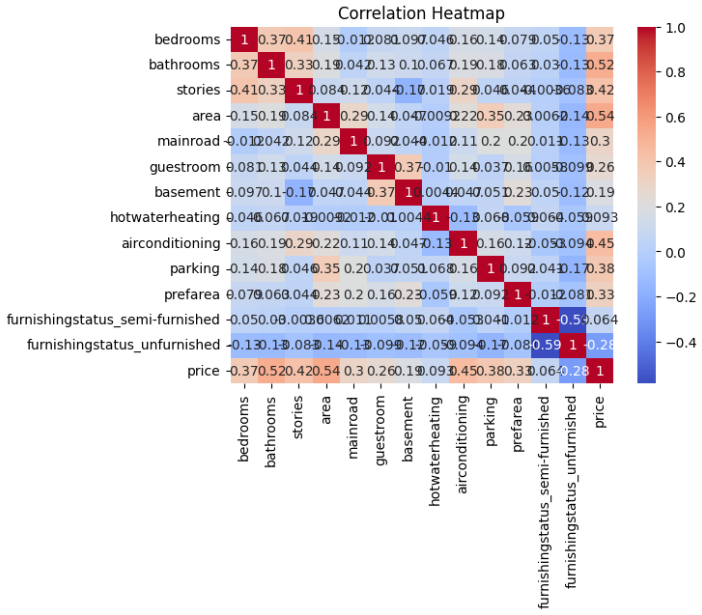
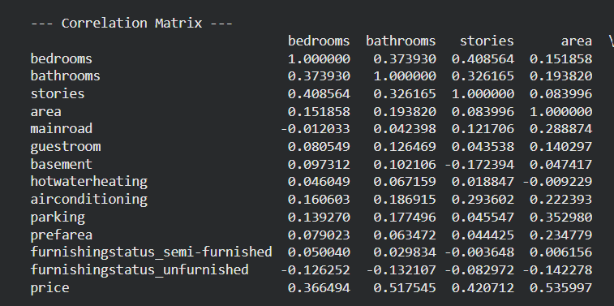
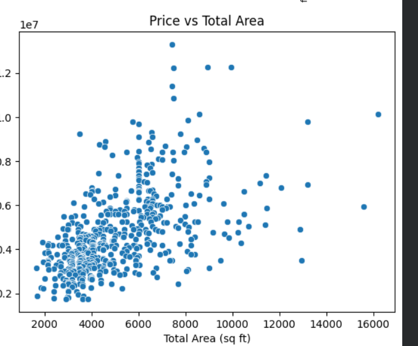
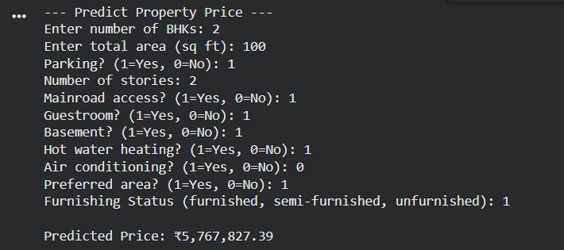

# 🏠 House Price Prediction Using Machine Learning

A Machine Learning project that predicts house prices using property features and **Linear Regression**. This project demonstrates data preprocessing, exploratory data analysis (EDA), model training, evaluation, visualization, and house price prediction using Python and Scikit-Learn.

---

## 📌 Project Overview

The objective of this project is to analyze housing data and predict house prices based on property-related features.

The project includes:

* Data Cleaning and Preprocessing
* Exploratory Data Analysis (EDA)
* Correlation Analysis
* Linear Regression Model Training
* Model Evaluation
* House Price Prediction
* Data Visualization

---

## 🚀 Technologies Used

### Programming Language

* Python

### Libraries

* Pandas
* NumPy
* Matplotlib
* Seaborn
* Scikit-Learn

### Machine Learning Algorithm

* Linear Regression

---

## 📂 Project Structure

```text
House_Price_Prediction/
│
├── Housing.csv
├── house.py
│
├── Images/
│   ├── Acutal_vs_predicted price.png
│   ├── Correlation_matrix1.png
│   ├── Matchingcity with price.png
│   ├── Mode_evaluation &Model comparison.png
│   ├── Predicted_price.png
│   ├── correlation_heatmap.png
│   └── price_vs_totalarea.png
│
└── README.md
```

---

## 🎯 Project Objective

The main objective of this project is to:

* Analyze housing market trends.
* Identify important factors affecting house prices.
* Train a machine learning model for price prediction.
* Evaluate model performance using regression metrics.
* Visualize feature relationships and prediction results.

---

## 🧠 Machine Learning Workflow

### 1. Data Collection

The dataset contains housing-related information such as:

| Feature          | Description             |
| ---------------- | ----------------------- |
| price            | House Price             |
| area             | House Area (sq.ft)      |
| bedrooms         | Number of Bedrooms      |
| bathrooms        | Number of Bathrooms     |
| stories          | Number of Floors        |
| parking          | Parking Spaces          |
| furnishingstatus | Furnishing Type         |
| mainroad         | Main Road Access        |
| guestroom        | Guest Room Availability |
| basement         | Basement Availability   |

---

### 2. Data Preprocessing

* Data Cleaning
* Feature Selection
* Handling Missing Values
* Encoding Categorical Features
* Data Transformation

---

### 3. Model Training

The dataset is divided into:

* 80% Training Data
* 20% Testing Data

The model is trained using Linear Regression:

```python
from sklearn.linear_model import LinearRegression
```

---

## 📊 Model Performance Metrics

### Model 1 – Area + Price per SQFT

This model uses:

* Area
* Price per SQFT

for prediction.

### Results

| Metric                      | Value    |
| --------------------------- | -------- |
| R² Score                    | 0.8588   |
| Variance Explained          | 85.88%   |
| Project Metric (R² × 10000) | 8588.22  |
| RMSE                        | ₹844,745 |
| MAE                         | ₹568,846 |
| MAPE                        | 11.07%   |

### Training Details

| Parameter        | Value |
| ---------------- | ----- |
| Train Samples    | 436   |
| Test Samples     | 109   |
| Train/Test Split | 80/20 |
| Random State     | 42    |

### Model Coefficients

| Feature        | Coefficient       |
| -------------- | ----------------- |
| Intercept      | ₹ -3,390,670      |
| Area           | +753.18 per sq.ft |
| Price per SQFT | +4,278.81         |

> Note: This model uses Price per SQFT, which is derived from the target price. Therefore, the high R² score may not represent a realistic production model.

---

## 📈 Realistic Model Performance

Features Used:

* Area
* Bedrooms
* Bathrooms
* Stories
* Parking
* Amenities
* Furnishing Status

### Results

| Metric                      | Value      |
| --------------------------- | ---------- |
| R² Score                    | 0.6529     |
| Variance Explained          | 65.29%     |
| Project Metric (R² × 10000) | 6529.24    |
| RMSE                        | ₹1,324,507 |
| MAE                         | ₹970,043   |
| MAPE                        | 21.04%     |

---

## 📖 Metric Explanation

| Metric     | Meaning                                                               |
| ---------- | --------------------------------------------------------------------- |
| R² Score   | Measures how much variation in house prices is explained by the model |
| RMSE       | Typical prediction error in rupees                                    |
| MAE        | Average absolute prediction error                                     |
| MAPE       | Average percentage prediction error                                   |
| R² × 10000 | Custom metric displayed by the project                                |

---

## 📊 Visualizations

### Correlation Heatmap



### Correlation Matrix



### Price vs Total Area



### City-wise Price Analysis


### Predicted House Price



### Actual vs Predicted Price


### Model Evaluation & Comparison


---

## ⚙️ Installation

Clone the repository:

```bash
git clone https://github.com/your-username/House_Price_Prediction.git
```

Move into the project folder:

```bash
cd House_Price_Prediction
```

Install dependencies:

```bash
pip install pandas numpy matplotlib seaborn scikit-learn
```

Run the project:

```bash
python house.py
```

---

## 🖥️ Sample Prediction

### Input

```text
Enter Total Area: 1200
Enter Price Per SQFT: 5000
```

### Output

```text
Predicted House Price:
₹ 6,000,000
```

---

## ⚠️ Current Repository Status

The current version of `house.py` expects:

```text
cleaned_dataset.csv
```

which is not included in the repository.

As a result:

```text
FileNotFoundError: cleaned_dataset.csv
```

may occur when running the project.

The repository currently contains:

```text
Housing.csv
```

which can be integrated into the prediction pipeline in a future update.

---

## 🔮 Future Enhancements

* Random Forest Regressor
* XGBoost Regressor
* Hyperparameter Tuning
* Cross Validation
* Feature Engineering
* Flask/FastAPI Deployment
* Interactive Web Application
* Real-Time House Price Prediction Dashboard

---

## 👨‍💻 Author

**Nandhakumar D**

Machine Learning Project – House Price Prediction Using Linear Regression

---

## ⭐ Support

If you found this project useful, please give it a ⭐ on GitHub.
